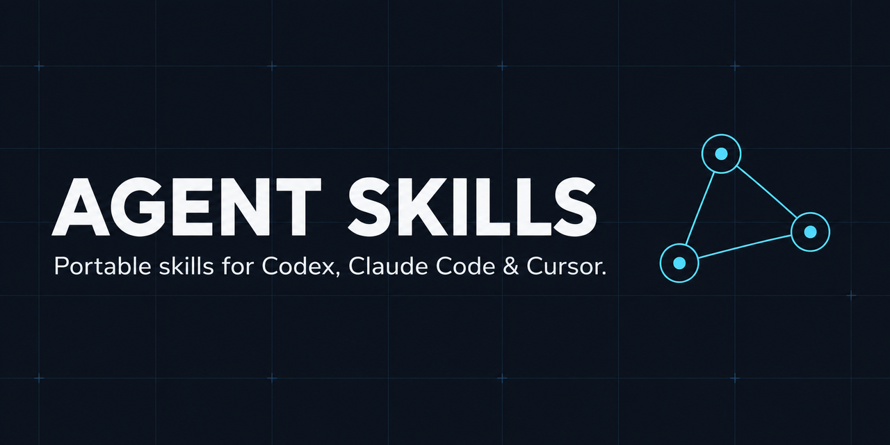

# Agent Skills

<p align="center">
  
</p>

[](https://github.com/Catherine1401/agent-skills/actions/workflows/test.yml)
[](LICENSE)

Portable skills and shared policies for Codex, Claude Code, and Cursor on Linux.

## Quick start

```sh
git clone https://github.com/Catherine1401/agent-skills.git
cd agent-skills
./install.sh --agent all --mode symlink
```

`symlink` is the default and keeps installed skills connected to this checkout.
Use `copy` for an independent installation that you update manually.

| Agent | Configuration directory |
| --- | --- |
| Codex | `~/.codex` |
| Claude Code | `~/.claude` |
| Cursor | `~/.cursor` |

## Update on another machine

After pushing a change from one machine, use a clean `main` checkout on another:

```sh
cd agent-skills
./sync.sh --agent all
```

`sync.sh` fast-forwards from `origin/main` and refreshes symlinked installs. It
also removes symlinks of skills that left `manifest.yaml`. It stops when local
changes or divergent history would make an update unsafe.

## Add a skill

1. Create `skills/<name>/SKILL.md`.
2. Add its matching source to `manifest.yaml`.
3. Add an adapter or shared policy only when required by a target agent.
4. Run the test suite.

```sh
./tests/test-install.sh
```

Skill names use lowercase kebab-case and must match their source directory.
`manifest.yaml` is the install source of truth; `shared-rules/` contains
canonical cross-agent policy.

## Installer options

```text
./install.sh --agent codex|claude|cursor|all \
  [--mode symlink|copy] [--no-rules] [--force] [--prune] [--dry-run]
```

Use `--dry-run` to inspect changes before installation. `--force` backs up an
existing target before replacing it. `--prune` removes symlinks into this
checkout whose skill is no longer in `manifest.yaml`. Override configuration locations with
`CODEX_HOME`, `CLAUDE_CONFIG_DIR`, or `CURSOR_CONFIG_DIR`.

## Uninstall

```text
./uninstall.sh --agent codex|claude|cursor|all [--yes] [--force] [--dry-run]
```

Removes installed skills, Cursor rules, and managed policy blocks, then restores
any `*.agent-skills-backup.*` that `--force` created. A modified copy is skipped.
`--agent all` also deletes this checkout: it asks for confirmation (`--yes` skips
it) and refuses uncommitted or unpushed work unless `--force`. Use `--dry-run`
first; it changes nothing.

## Contributing

Read [CONTRIBUTING.md](CONTRIBUTING.md) and [AGENTS.md](AGENTS.md). Keep pull
requests focused and verify changes with `./tests/test-install.sh`.

## License

[MIT](LICENSE) © 2026 Catherine1401.
