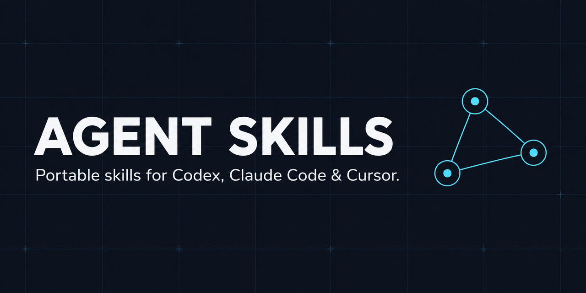

# Agent Skills

<p align="center">
  
</p>

[](https://github.com/Catherine1401/agent-skills/actions/workflows/test.yml)
[](LICENSE)

Portable skills and shared policies for Codex, Claude Code, and Cursor on Linux.

## Quick start

```sh
git clone https://github.com/Catherine1401/agent-skills.git
cd agent-skills
./install.sh --agent all --mode symlink
```

`symlink` is the default and keeps installed skills connected to this checkout.
Use `copy` for an independent installation that you update manually.

| Agent | Configuration directory |
| --- | --- |
| Codex | `~/.codex` |
| Claude Code | `~/.claude` |
| Cursor | `~/.cursor` |

The installer places skills in `<configuration-directory>/skills/`. The paths
above are the current script defaults; override them with `CODEX_HOME`,
`CLAUDE_CONFIG_DIR`, or `CURSOR_CONFIG_DIR`.

## Available skills

Skills are registered in [manifest.yaml](manifest.yaml); every manifest skill
is installed for all three agents.

| Skill | Purpose |
| --- | --- |
| `commit` | Prepare task-scoped commits and wait for user approval. |
| `user-policy` | Update shared policy, test it, and install it for all three agents. |
| `user-policy-pj` | Update the current project's own policy file (root `CLAUDE.md`, else `.claude/CLAUDE.md`, else `AGENTS.md`) with project-specific rules; never edits user-level policy. |
| `skill-creator` | Create or update portable skills. |
| `skill-creator-pj` | Create or update project-local skills; generated project skills are not registered in `manifest.yaml`; `.claude` ones sync through the private projects repository (see Project-level config). |
| `use` | Reuse complete skill instructions already embedded in the prompt. |
| `report` | Save or update task handoffs in `.docs/context/`. |
| `learn` | Save verified lessons in `.docs/learn/`, one file per conversation. |
| `refactor` | Delegate rule verification of every changed file type to a `verify` subagent with a separate context. |
| `test` | Guide users through testing changed code; provide mocks when the user says required APIs or backend dependencies are unavailable. |
| `ok` | Approve the agent's latest pending confirmation request, or confirm its latest result as verified when it asks the user to check. |
| `video` | Read a video file (`.mp4`, `.mov`, `.webm`) by extracting frames with `ffmpeg` and summarizing what it shows, e.g. a QA bug recording. |

Invoke `$refactor` to request verification. The skill creates a `verify`
subagent at runtime; it does not install a subagent configuration or a separate
`$verify` command. If the environment cannot provide a fresh-context subagent,
the skill reports incomplete verification instead of reading all rules in the
main context.

## Update on another machine

After pushing a change from one machine, use a clean `main` checkout on another:

```sh
cd agent-skills
./sync.sh --agent all
```

`sync.sh` fast-forwards from `origin/main` (and the projects checkout, when
present) and refreshes symlinked installs at user and project scope. It also
removes symlinks of skills that left `manifest.yaml`. It stops when local
changes or divergent history would make an update unsafe.

## Project-level config

Each project's own `.claude/` entries (skills, `CLAUDE.md`, commands, hooks,
`settings.json`, and so on) sync across machines the same way as user-level
skills. They live in a separate **private** repository checked out at
`~/agent-skills-projects` (override with `AGS_PROJECTS_DIR`); this public
repository never holds project content.

```text
registry.yaml                  # projects.<id>: <origin URL of the project>
projects/<id>/.claude/...      # entries symlinked into <project>/.claude/
```

Each machine declares where to look in an untracked
`~/.config/agent-skills/local.yaml` (override with `AGS_LOCAL_CONFIG`):

```yaml
roots:
  - /home/you                  # the root and its direct subdirectories are scanned;
                               # a repository matches when its normalized `origin`
                               # is in the registry
overrides:
  my-project: /path/to/project # for a project without a remote or outside the roots
```

Every match also expands through `git worktree list`; a project that is absent
on a machine is skipped. One `./sync.sh --agent all` updates user and every
project at once.

Runtime entries (`settings.local.json`, `jobs`, `worktrees`, `scheduled_tasks.*`,
`checkpoints`, `mailbox`, `routines`, `agent-registry.json`, `agent-memory-local`,
`first-run`, `assistant-daemon-state.json`) are never imported, linked, or pruned.

Add a project:

```sh
./import-project.sh --id <id> --path <project> [--dry-run]
git -C ~/agent-skills-projects add -A   # then commit and push the projects repository
./install.sh --scope project --force    # first run only: backs up the real entries it replaces
```

`import-project.sh` copies the project's non-runtime entries, registers its
`origin`, never overwrites an existing entry, and never commits or pushes.
`sync.sh` does not pass `--force`, so the first install on each machine needs the
command above. `./uninstall.sh --scope project` removes the links and restores
the backups.

## Add a skill

1. Create `skills/<name>/SKILL.md`.
2. Add its matching source to `manifest.yaml`.
3. Add an adapter or shared policy only when required by a target agent.
4. Run the test suite.

```sh
./tests/test-install.sh
```

Skill names use lowercase kebab-case and must match their source directory.
`manifest.yaml` is the install source of truth; `shared-rules/` contains
canonical cross-agent policy.

`SKILL.md` requires YAML frontmatter with a matching `name` and a non-empty
`description`. Skill and policy content must be in English. Installer tests
verify distribution, not frontmatter or skill behavior; validate those
separately. See [CONTRIBUTING.md](CONTRIBUTING.md) for the sync test fixture
limitations.

## User policy

`shared-rules/user.md` holds your user-level instructions for every agent. The
installer writes it as a managed block in `~/.claude/CLAUDE.md` and
`~/.codex/AGENTS.md`, and generates `~/.cursor/rules/user.mdc`. Edit the file in
this repository, then run `./install.sh` (or `./sync.sh` on other machines).
Edits made inside the installed copies are overwritten on the next run; text
outside the managed block is kept.

Add another policy with a `policies:` entry in `manifest.yaml`: `source` under
`shared-rules/`, plus `cursor` (a ready `.mdc`) or `cursor_header` (a
frontmatter file joined with `source` at install time).

## Installer options

```text
./install.sh --agent codex|claude|cursor|all [--scope user|project|all] \
  [--mode symlink|copy] [--no-rules] [--force] [--prune] [--dry-run]
```

`--scope` defaults to `user`; `project` links project-level config (symlinks unless `--mode copy`) and needs
no `--agent`. Use `--dry-run` to inspect changes before installation. `--force` backs up an
existing target before replacing it. `--prune` removes symlinks into this
checkout whose skill is no longer in `manifest.yaml`. Override configuration locations with
`CODEX_HOME`, `CLAUDE_CONFIG_DIR`, or `CURSOR_CONFIG_DIR`.

## Uninstall

```text
./uninstall.sh --agent codex|claude|cursor|all [--scope user|project|all] [--yes] [--force] [--dry-run]
```

Removes installed skills, Cursor rules, and managed policy blocks, then restores
any `*.agent-skills-backup.*` that `--force` created. A modified copy is skipped.
`--scope project` removes only project links and restores their backups.
`--agent all` (with a scope other than `project`) also deletes this checkout: it asks for confirmation (`--yes` skips
it) and refuses uncommitted or unpushed work unless `--force`. Use `--dry-run`
first; it changes nothing.

## Contributing

Read [CONTRIBUTING.md](CONTRIBUTING.md) and [AGENTS.md](AGENTS.md). Keep pull
requests focused and verify changes with `./tests/test-install.sh`.

## License

[MIT](LICENSE) © 2026 Catherine1401.
